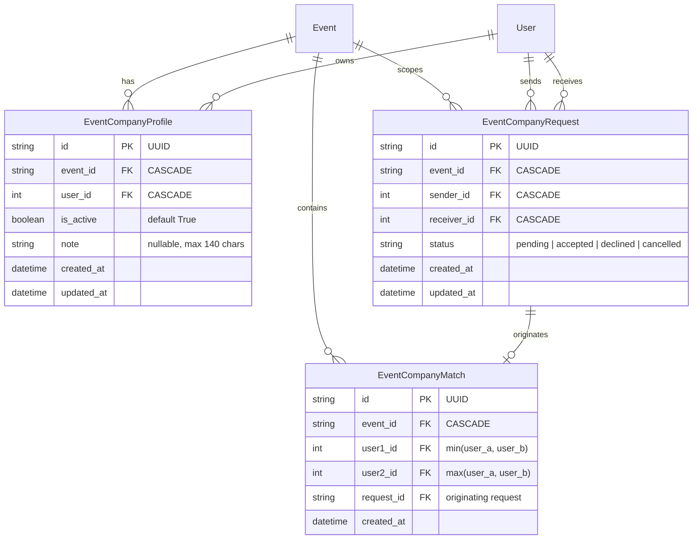

# Ivently — Product & Architecture Contract: Social Discovery Foundation («Найти компанию»)
## Sprint C3.0

---

## 1. Product Goal & Philosophy

### Контекст и проблема
Ivently объединяет афишу городских событий, локации и организации. Однако для многих пользователей ключевым барьером посещения мероприятий является **отсутствие компании**:
* *«Мне очень интересен этот концерт / стендап / выставка, но никто из друзей не может или не разделяет мой вкус»*.
* Пойти одному часто психологически некомфортно.
* Существующие социальные сети или дейтинг-приложения не решают эту задачу: они оторваны от контекста конкретного события, наполнены спамом и имеют нерелевантную романтическую коннотацию.

### Цель механики «Найти компанию»
Дать пользователям Ivently безопасный, ненавязчивый и привязанный к конкретному мероприятию способ **найти попутчика / компанию единомышленников**.

### Фундаментальные продуктовые принципы
1. **Event-Centric (строго вокруг события)**:
   * Никакого глобального поиска людей по платформе.
   * Никакого каталога «Люди рядом» или «Пользователи Махачкалы/Москвы».
   * Социальная активность существует **исключительно внутри контекста конкретного `event_id`**.
2. **Non-Dating (не дейтинг)**:
   * Никаких свайпов а-ля Tinder/Bumble.
   * Никаких сердечек «лайков людей», оценок внешности или рейтингов популярности.
   * Тональность общения: клуб по интересам, поиск напарника на мероприятие («Мы оба собираемся на это событие — пойдём вместе»).
3. **Explicit Opt-In (разделение интереса и видимости)**:
   * Нажатие «Хочу пойти» или «Я иду» выражает отношение к мероприятию, но **НЕ** означает согласие на публичность.
   * Для поиска компании требуется отдельное, осознанное действие: **«Найти компанию»**.

---

## 2. User Flows & Scenarios

### Сценарий 1: Первичный вход и Opt-In (Включение поиска компании)
```
[ Карточка события в EventDetailsModal ]
      │
      ▼
Пользователь нажал «Хочу пойти» (Interest) или «Я иду» (RSVP)
      │
      ▼
Появляется ненавязчивый блок в теле модалки:
┌─────────────────────────────────────────────────────────────┐
│ 👥 Компания на событие                                      │
│ 4 человека ищут компанию на это мероприятие                 │
│                                                             │
│ [ Найти компанию ]                                          │
└─────────────────────────────────────────────────────────────┘
      │
      ▼ (Пользователь нажимает «Найти компанию»)
Открывается Bottom Sheet с прозрачным Privacy-соглашением:
┌─────────────────────────────────────────────────────────────┐
│ 👥 Ищете компанию?                                         │
│ Покажите другим участникам этого события, что вы открыты     │
│ к знакомству.                                               │
│                                                             │
│ Что увидят другие:                                          │
│ • Ваше имя и фото из Telegram                               │
│ • Статус («Хочет пойти» или «Идёт»)                         │
│ • Ваш Telegram @username будет скрыт до взаимного согласия! │
│                                                             │
│ [ Включить поиск компании ]                                 │
│ [ Не сейчас ]                                               │
└─────────────────────────────────────────────────────────────┘
      │
      ▼
Пользователь подтверждает -> Создается/активируется `EventCompanyProfile`.
Открывается `EventCompanyModal` со списком участников.
```

### Сценарий 2: Просмотр списка участников и отправка запроса
```
Внутри EventCompanyModal:
┌─────────────────────────────────────────────────────────────┐
│ ← Назад      Компания на «Вечер джаза»                      │
├─────────────────────────────────────────────────────────────┤
│ 🟢 Ваша анкета видна другим участникам  [ Скрыть анкету ]   │
├─────────────────────────────────────────────────────────────┤
│ 👥 Ищут компанию (3)                                        │
│                                                             │
│ ┌─────────────────────────────────────────────────────────┐ │
│ │ [Аватар]  Алексей                     ● Хочет пойти     │ │
│ │           «Люблю живой джаз, ищу с кем пойти!»          │ │
│ │                                                         │ │
│ │           [ Познакомиться ]                             │ │
│ └─────────────────────────────────────────────────────────┘ │
│ ┌─────────────────────────────────────────────────────────┐ │
│ │ [Аватар]  Марина                      ● Идёт            │ │
│ │           [ Запрос отправлен ⏳ ]                       │ │
│ └─────────────────────────────────────────────────────────┘ │
└─────────────────────────────────────────────────────────────┘
```

### Сценарий 3: Получение и принятие запроса (Mutual Match)
```
1. Пользователь B открывает событие или получает уведомление в Telegram:
   «👋 Пользователь Алексей хочет пойти с вами на событие "Вечер джаза"!»
2. Пользователь B открывает EventCompanyModal, видит секцию «Входящие запросы»:
┌─────────────────────────────────────────────────────────────┐
│ 📬 Входящие запросы (1)                                      │
│ ┌─────────────────────────────────────────────────────────┐ │
│ │ [Аватар]  Алексей хочет пойти с вами                    │ │
│ │                                                         │ │
│ │           [ Принять ]          [ Отклонить ]            │ │
│ └─────────────────────────────────────────────────────────┘ │
└─────────────────────────────────────────────────────────────┘
3. Пользователь B нажимает [ Принять ]:
   • Статус запроса переходит в `accepted`.
   • Фиксируется `EventCompanyMatch`.
   • Отображается карточка взаимного согласия:
┌─────────────────────────────────────────────────────────────┐
│ 🎉 Вы нашли компанию!                                       │
│ Вы и Алексей идёте на «Вечер джаза» вместе.                 │
│                                                             │
│ [ Написать в Telegram (@alex_jazz) ↗ ]                      │
└─────────────────────────────────────────────────────────────┘
```

### Сценарий 4: Opt-Out (Отключение видимости)
```
Пользователь нажимает [ Скрыть анкету ] / [ Перестать искать компанию ]:
1. Флаг `is_active` переключается в `false`.
2. Пользователь мгновенно исчезает из списка «Ищут компанию» для этого события.
3. Новые запросы к пользователю заблокированы.
4. Уже сформированные взаимные совпадения (Matches) сохраняются, чтобы не терять контакт.
```

---

## 3. Privacy Model

| Уровень публичности | Какие данные видны | Кому видны |
| :--- | :--- | :--- |
| **До Opt-In** | Ничего (пользователь полностью невидим в социальном слое). | Никому |
| **После Opt-In (В списке участников)** | `first_name`, `avatar_url`, статус участия (`is_attending`/`is_interested`), дата вступления, опциональная заметка `note`. | Только другим авторизованным участникам этого же события, включившим поиск компании. |
| **После Mutual Match (Взаимное принятие)** | Telegram `username` (в виде ссылки `https://t.me/username`), статус совпадения. | Только подтвержденному взаимному партнеру по событию. |
| **Строго запрещено к передаче** | Телефон, email, числовой `telegram_id`, внутренний `id` БД, геолокация, история других посещенных событий. | Никому и никогда через API. |

### Принцип сокрытия Telegram Username до Match
Если показывать @username сразу всем в списке:
* Пользователи столкнутся со спамом в личные сообщения Telegram вне контекста приложения.
* Пропадает ценность взаимного согласия.
* Пользователи (особенно девушки) перестанут пользоваться функцией из-за риска домогательств.

**Правило:** До тех пор, пока запрос не переведен в статус `accepted` получателем, @username **не отдается с бэкенда**.

---

## 4. Data Model

Для реализации архитектуры C3.0 в реляционной БД (PostgreSQL / SQLite) создаются три взаимосвязанные модели:



### 1. Таблица `event_company_profiles`
Определяет явное согласие пользователя на поиск компании для конкретного события.

```python
class EventCompanyProfile(Base):
    __tablename__ = "event_company_profiles"

    id = Column(String(36), primary_key=True, default=lambda: str(uuid.uuid4()))
    event_id = Column(String(36), ForeignKey("events.id", ondelete="CASCADE"), nullable=False, index=True)
    user_id = Column(Integer, ForeignKey("users.id", ondelete="CASCADE"), nullable=False, index=True)
    is_active = Column(Boolean, default=True, nullable=False, index=True)
    note = Column(String(140), nullable=True)  # Краткая заметка (до 140 символов)
    created_at = Column(DateTime(timezone=True), default=utc_now, nullable=False)
    updated_at = Column(DateTime(timezone=True), default=utc_now, onupdate=utc_now, nullable=False)

    __table_args__ = (
        UniqueConstraint("event_id", "user_id", name="uq_event_company_profile"),
        Index("idx_company_profiles_feed", "event_id", "is_active", "created_at"),
    )
```

### 2. Таблица `event_company_requests`
Хранит направленные запросы на знакомство от одного участника к другому.

```python
class EventCompanyRequest(Base):
    __tablename__ = "event_company_requests"

    id = Column(String(36), primary_key=True, default=lambda: str(uuid.uuid4()))
    event_id = Column(String(36), ForeignKey("events.id", ondelete="CASCADE"), nullable=False, index=True)
    sender_id = Column(Integer, ForeignKey("users.id", ondelete="CASCADE"), nullable=False, index=True)
    receiver_id = Column(Integer, ForeignKey("users.id", ondelete="CASCADE"), nullable=False, index=True)
    status = Column(String(20), default="pending", nullable=False, index=True) # pending, accepted, declined, cancelled
    created_at = Column(DateTime(timezone=True), default=utc_now, nullable=False)
    updated_at = Column(DateTime(timezone=True), default=utc_now, onupdate=utc_now, nullable=False)

    __table_args__ = (
        UniqueConstraint("event_id", "sender_id", "receiver_id", name="uq_event_company_request"),
        CheckConstraint("sender_id != receiver_id", name="ck_company_request_no_self"),
        Index("idx_company_requests_receiver", "event_id", "receiver_id", "status"),
        Index("idx_company_requests_sender", "event_id", "sender_id", "status"),
    )
```

### 3. Таблица `event_company_matches`
Фиксирует подтвержденное взаимное согласие двух пользователей пойти на событие вместе.

```python
class EventCompanyMatch(Base):
    __tablename__ = "event_company_matches"

    id = Column(String(36), primary_key=True, default=lambda: str(uuid.uuid4()))
    event_id = Column(String(36), ForeignKey("events.id", ondelete="CASCADE"), nullable=False, index=True)
    user1_id = Column(Integer, ForeignKey("users.id", ondelete="CASCADE"), nullable=False)
    user2_id = Column(Integer, ForeignKey("users.id", ondelete="CASCADE"), nullable=False)
    request_id = Column(String(36), ForeignKey("event_company_requests.id", ondelete="CASCADE"), nullable=False)
    created_at = Column(DateTime(timezone=True), default=utc_now, nullable=False)

    __table_args__ = (
        # Канонический порядок user1_id < user2_id гарантирует ровно одну запись на пару
        UniqueConstraint("event_id", "user1_id", "user2_id", name="uq_event_company_match"),
        CheckConstraint("user1_id < user2_id", name="ck_company_match_canonical_order"),
        Index("idx_company_matches_u1", "event_id", "user1_id"),
        Index("idx_company_matches_u2", "event_id", "user2_id"),
    )
```

---

## 5. API Design

Все эндпоинты монтируются в `/api/v1/events/{event_id}/company` и требуют валидной авторизации Telegram WebApp (`get_current_user`).

### 1. `GET /api/v1/events/{event_id}/company/status`
Получение текущего статуса социального поиска пользователя для события.
* **Response**:
```json
{
  "event_id": "uuid",
  "is_opted_in": true,
  "is_active": true,
  "note": "Ищу компанию на вечер джаза",
  "active_members_count": 4,
  "pending_incoming_count": 1,
  "matches_count": 1
}
```

### 2. `POST /api/v1/events/{event_id}/company/profile`
Включение/обновление анкеты для поиска компании (Opt-In).
* **Body**:
```json
{
  "is_active": true,
  "note": "Краткая заметка (до 140 символов, опционально)"
}
```
* **Response**: `CompanyProfileResponse`

### 3. `DELETE /api/v1/events/{event_id}/company/profile`
Выключение видимости (Opt-Out).
* Переводит `is_active` в `false`. Не удаляет историю совпадений.
* **Response**: `{"ok": true, "message": "Поиск компании приостановлен"}`

### 4. `GET /api/v1/events/{event_id}/company/members`
Список других участников, включивших поиск компании для этого события.
* **Query**: `limit=20, offset=0`
* **Правила фильтрации**:
  * Исключает самого текущего пользователя (`user_id != current_user.id`).
  * Только активные (`is_active == True`).
  * Аннотирует отношение с текущим пользователем:
    * `request_status`: `null` (нет запроса) | `sent_pending` (я отправил) | `received_pending` (мне отправили) | `matched` (уже совпали).
* **Response**:
```json
[
  {
    "user_id": 42,
    "first_name": "Алексей",
    "avatar_url": "https://...",
    "attendance_status": "interested",
    "note": "Люблю джаз!",
    "joined_at": "2026-09-30T10:00:00Z",
    "relationship_status": "none"
  }
]
```
*(Заметьте: поле `username` и `telegram_id` намеренно ОТСУТСТВУЮТ!)*

### 5. `POST /api/v1/events/{event_id}/company/requests`
Отправка запроса на совместный поход.
* **Body**: `{"target_user_id": 42}`
* **Логика взаимности (Cross-Request Auto-Accept)**:
  * Если `target_user_id` уже ранее отправил запрос текущему пользователю в статусе `pending`, бэкенд **автоматически акцептует запрос** и создает `EventCompanyMatch`!
  * Иначе создает запрос в статусе `pending`.
* **Response**: `CompanyRequestResponse`

### 6. `GET /api/v1/events/{event_id}/company/requests`
Список входящих и исходящих запросов текущего пользователя по данному событию.
* **Response**:
```json
{
  "incoming": [
    {
      "request_id": "uuid",
      "sender": {
        "user_id": 15,
        "first_name": "Елена",
        "avatar_url": "https://...",
        "attendance_status": "attending"
      },
      "created_at": "2026-09-30T11:00:00Z"
    }
  ],
  "outgoing": [
    {
      "request_id": "uuid",
      "receiver_id": 42,
      "receiver_first_name": "Алексей",
      "status": "pending",
      "created_at": "2026-09-30T10:30:00Z"
    }
  ]
}
```

### 7. `POST /api/v1/events/{event_id}/company/requests/{request_id}/accept`
Принятие входящего запроса.
* Меняет статус на `accepted`.
* Создает запись в `event_company_matches`.
* **Response**: Возвращает `MatchResponse` с **раскрытым** контактом Telegram (`telegram_username`).

### 8. `POST /api/v1/events/{event_id}/company/requests/{request_id}/decline`
Отклонение входящего запроса.
* Меняет статус на `declined`.

### 9. `DELETE /api/v1/events/{event_id}/company/requests/{request_id}`
Отзыв исходящего запроса отправителем.
* Переводит статус в `cancelled` (или удаляет запись).

### 10. `GET /api/v1/events/{event_id}/company/matches`
Список подтвержденных совпадений по данному событию.
* **Response**:
```json
[
  {
    "match_id": "uuid",
    "partner": {
      "user_id": 15,
      "first_name": "Елена",
      "avatar_url": "https://...",
      "telegram_username": "elena_arts",
      "telegram_url": "https://t.me/elena_arts"
    },
    "matched_at": "2026-09-30T11:15:00Z"
  }
]
```

---

## 6. Request & Match Lifecycle

### Автомат состояний запроса (`EventCompanyRequest`):
```
            ┌───────────────────┐
            │      DRAFT        │
            └─────────┬─────────┘
                      │ POST /requests
                      ▼
            ┌───────────────────┐
       ┌───►│     PENDING       │◄───┐
       │    └─────┬───────┬─────┘    │
Cancel │          │       │          │ Cross-request auto-accept
       │   Accept │       │ Decline  │
       ▼          ▼       ▼          │
┌───────────┐ ┌────────┐ ┌──────────┐│
│ CANCELLED │ │ACCEPTED│ │ DECLINED ││
└───────────┘ └───┬────┘ └──────────┘│
                  │                  │
                  ▼                  │
            ┌──────────┐             │
            │  MATCH   │─────────────┘
            │ CREATED  │
            └──────────┘
```

1. **PENDING**: Запрос отправлен, ожидает ответа адресата. Отправитель видит кнопку «Запрос отправлен ⏳».
2. **ACCEPTED**: Адресат подтвердил запрос (или сработал встречный запрос). Создается запись `EventCompanyMatch`. Обоим пользователям раскрывается контакт для связи.
3. **DECLINED**: Адресат отклонил запрос. Повторная отправка запроса от этого отправителя этому адресату на это событие **заблокирована** во избежание назойливости.
4. **CANCELLED**: Отправитель передумал и отозвал запрос до ответа адресата.

---

## 7. Edge Cases & Handling

1. **Пользователь отменяет интерес или участие («Хочу пойти» / «Я иду»)**:
   * Если пользователь больше не идет и не планирует идти на мероприятие, он не может числиться среди ищущих компанию.
   * *Действие*: триггер сервисного слоя автоматически переводит `EventCompanyProfile.is_active = False`.
2. **Событие отменено или удалено**:
   * Внешние ключи имеют `ondelete="CASCADE"`, при удалении события все профили, запросы и матчи каскадно очищаются.
3. **Попытка отправить запрос самому себе**:
   * Блокируется на уровне схемы FastAPI, сервисного слоя (`if sender_id == target_user_id: raise HTTPException(400)`) и `CheckConstraint("sender_id != receiver_id")`.
4. **Повторные клики и Race Conditions**:
   * `UniqueConstraint("event_id", "sender_id", "receiver_id")` гарантирует невозможность создания дублирующих записей.
   * На фронтенде кнопка блокируется флагом `isLoading`.
5. **Встречный запрос (А отправил Б, а Б одновременно отправил А)**:
   * Сервис проверяет наличие обратного `pending` запроса. Если он существует, статус переводится в `accepted` без генерации ошибки уникальности.
6. **У пользователя отсутствует публичный @username в Telegram**:
   * В Telegram у ряда пользователей скрыт никнейм (только имя и телефон).
   * *Решение*: UI отображает имя партнера и подсказку: «У пользователя не настроен @username в Telegram. Вы можете написать ему в общих чатах или дождаться сообщения».

---

## 8. Telegram Limitations & Reality Lock

| Предположение | Реальность Telegram Bot API | Архитектурное решение в Ivently |
| :--- | :--- | :--- |
| «Бот может создать приватную группу для двух пользователей» | ❌ **Невозможно**. Telegram Bot API запрещает ботам инициировать создание групп и добавлять пользователей без прав админа. | Используем прямую ссылку `https://t.me/<username>`, открывающую нативный диалог в Telegram. |
| «Бот может отправить личное сообщение от лица одного пользователя другому» | ❌ **Невозможно**. Боты могут писать только от своего имени и только тем пользователям, кто нажал `/start`. | Бот может прислать уведомление от `@Ivently_bot`: «Алексей хочет пойти с вами на событие Х! [Открыть Ivently]». |
| «Бот может принудительно открыть чат внутри WebApp» | ❌ **Невозможно**. Telegram Mini App изолирован в WebView. | Используется нативный метод `Telegram.WebApp.openTelegramLink("https://t.me/" + username)`. |

---

## 9. Security Considerations

1. **Аутентификация**:
   * Все вызовы проверяются через HMAC-SHA256 валидацию Telegram `initData` со свежестью `auth_date <= 300s` и постоянным временем сравнения `hmac.compare_digest`.
2. **Авторизация**:
   * Пользователь может управлять только своими записями (`user_id == current_user.id`).
   * Нельзя принять чужой запрос (`request.receiver_id == current_user.id`).
3. **Защита от скрапинга и спама**:
   * Лимит на отправку запросов: не более 10 активных запросов на одно событие от одного пользователя.
   * @username отдается **только** в ответе эндпоинта `/matches` и только тем пользователям, чьи `user_id` входят в пару матча.

---

## 10. UX & Visual Proposal

### Точки входа
1. **Внутри EventDetailsModal**:
   * Компактный блок над футером с аватарками первых 3 участников:
   `👥 Ищут компанию (4) • [ Присоединиться ]`
2. **Отдельный экран `EventCompanyModal`**:
   * Верхний бар с кнопкой «Назад» и заголовком «Компания на событие».
   * Плашка статуса текущего пользователя с переключателем «Виден другим».
   * Секция «Входящие запросы» (если есть) с кнопками «Принять» и «Отклонить».
   * Секция «Совпадения» (если есть) с ярким бейджем и кнопкой перехода в Telegram.
   * Секция «Ищут компанию» с карточками участников.

### Стилистика
* Использование дизайн-токенов Ivently: глубокий темный фон (`#0B0D13`, `#131722`), акцентный фиолетовый (`--brand-purple`, `bg-purple-600`), мягкие границы (`border-white/8`).
* Отсутствие романтических клише — чистый, стильный городской UI.

---

## 11. Future Chat Architecture (Sprint C3.1+)

В C3.0 для связи используется нативный переход в Telegram (`t.me/username`).
Если в будущем (C3.1+) потребуется встроенный чат внутри Ivently:
1. Таблица `company_messages (id, match_id, sender_id, text, created_at, read_at)`.
2. Доставка сообщений через Server-Sent Events (SSE) или WebSockets с привязкой к `match_id`.
3. Push-уведомления через Telegram-бота о новых непрочитанных сообщениях.

---

## 12. Explicitly Out of Scope for C3.0

Следующие функции **строго исключены** из Sprint C3.0:
* ❌ Внутренний чат, мессенджер, WebSockets.
* ❌ Создание групп Telegram или каналов.
* ❌ Поиск людей по всему городу вне конкретного события.
* ❌ Рейтинги пользователей, лайки профилей, алгоритмы дейтинг-матчинга.
* ❌ Система «Друзья», «Подписчики на людей» (подписки остаются только на организации).
* ❌ Сложный конструктор публичного профиля (интересы, теги, био на 1000 символов).

---

## 13. Summary & Decision Checklist

* [x] **Event-scoped isolation**: Социальная активность строго привязана к `event_id`.
* [x] **Privacy opt-in**: Нажатие «Хочу пойти» не делает пользователя видимым; требуется отдельный opt-in.
* [x] **Zero spam leak**: @username скрыт до взаимного подтверждения запроса.
* [x] **Database safety**: Уникальные ключи и проверки предотвращают дубли и спам.
* [x] **Zero regression**: Существующий функционал событий, организаций, поиска и интереса не затрагивается.
