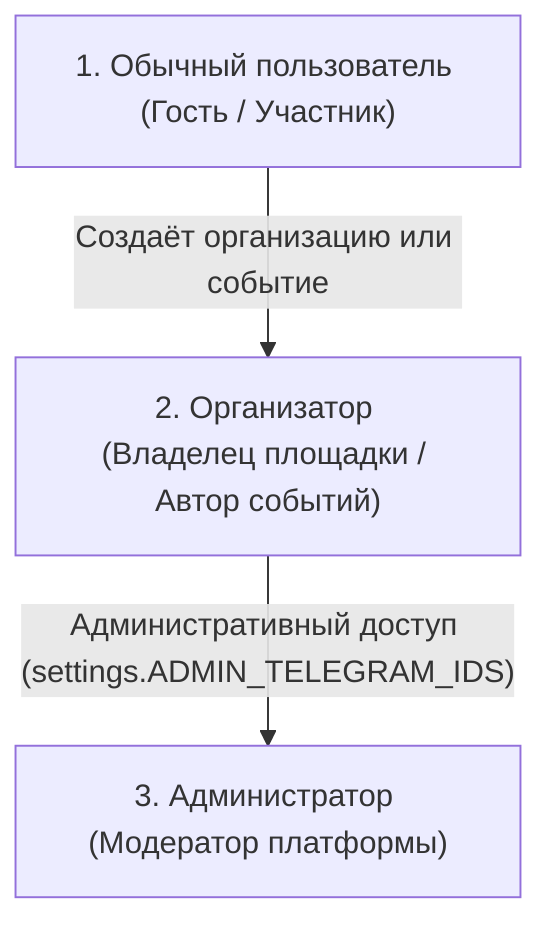
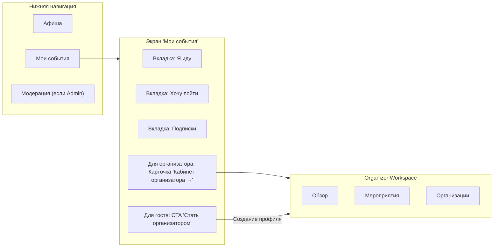

# Ivently — Architecture & Product Specification: Organizer Workspace (D1.0)

**Document Version:** 1.0.0  
**Status:** Approved Architecture Draft  
**Scope:** Sprint D1.0 (Audit & Product Architecture)  
**System:** Ivently — Telegram Mini App  

---

## 1. Current State (Текущее состояние)

В Ivently в настоящий момент реализована базовая функциональность для авторов мероприятий и владельцев заведений:

1. **Модели данных (`backend/app/models/`):**
   - `Organization`: содержит `id`, `owner_user_id`, `name`, `slug`, `description`, `category`, `city_id`, `address`, `avatar_url`, `website`, `social_link`, `status` (`active`/`disabled`), `is_verified`.
   - `Event`: содержит `id`, `title`, `description`, `cover_image_url`, `start_at`, `venue_name`, `address`, `price_amount`, `price_currency`, `status` (`pending`, `published`, `rejected`, `cancelled`), `organizer_user_id`, `organization_id`, `rejection_reason`.
   - `Subscription`: связь между пользователем и организацией (`user_id`, `organization_id`, `created_at`).
   - `EventAttendee` (RSVP «Я иду») и `EventInterest` («Хочу пойти»).

2. **Backend API (`backend/app/api/v1/`):**
   - `GET /api/v1/organizer/events`: возвращает список всех мероприятий, созданных пользователем (`organizer_user_id == current_user.id`), с подсчётом `attendee_count`.
   - `GET /api/v1/organizations/me`: возвращает список организаций, принадлежащих текущему пользователю (`owner_user_id == current_user.id`), со счётчиками `followers_count` и `events_count`.
   - `POST /api/v1/organizations`: создание профиля организации с валидацией категорий и уникального слага.
   - `PATCH /api/v1/organizations/{org_id}`: редактирование профиля организации с проверкой прав владельца.
   - `POST /api/v1/events`: создание события с привязкой к организации или личному профилю (всегда попадает в статус `pending`).
   - Загрузка медиа: `POST /api/v1/events/upload-cover` и `POST /api/v1/organizations/upload-avatar` с валидацией magic bytes и сохранением в персистентное хранилище.

3. **Frontend UI (`frontend/src/`):**
   - Нижняя навигация (`Navigation.tsx`): 4 вкладки — `feed` («Афиша»), `create` («Создать»), `organizer` («Мои события»), `admin` («Модерация», только для админа).
   - Вкладка «Мои события» (`OrganizerTab.tsx`): содержит верхний баннер «Кабинет организатора» с кнопкой «Создать», блок «Мои организации» с кнопкой «Создать профиль», и плоский список «Мои мероприятия».
   - Модальные окна: `CreateEventModal`, `CreateOrganizationModal`, `OrganizationModal` (с кнопками владельца «Редактировать профиль» и «Создать событие»).

---

## 2. Current UX Problems (Текущие UX-проблемы)

Аудит выявил следующие структурные противоречия:

1. **Коллизия смыслов в «Мои события»:**
   - Вкладка в нижней навигации называется «Мои события» (иконка `Calendar`), что для любого мобильного пользователя означает: *«Куда я иду, что я сохранил, мои билеты и планы»*.
   - Однако при открытии этой вкладки обычный пользователь попадает в **панель создателя контента** («Кабинет организатора», предложение создать организацию, список созданных им мероприятий).
   - Обычному посетителю городских событий негде посмотреть мероприятия, на которые он нажал «Я иду» или «Хочу пойти»!

2. **Неоправданная вкладка «Создать» в глобальной навигации:**
   - В нижней панели навигации вкладка «Создать» (`PlusCircle`) занимает 25% ценного экранного пространства для 100% пользователей.
   - Более 95% пользователей Ivently — потребители контента (ищут, куда сходить вечером). Постоянная глобальная кнопка «Создать» визуально захламляет интерфейс.

3. **Смешение контекстов (личный профиль vs организация):**
   - Мероприятия в `OrganizerTab` выводятся единым списком, независимо от того, созданы ли они от имени конкретного бара/клуба или от личного имени пользователя. При наличии нескольких организаций ориентироваться в таком списке невозможно.

4. **Отсутствие сегментации жизненного цикла событий:**
   - Мероприятие, прошедшее полгода назад, отклонённое модератором с причиной, событие на проверке и предстоящий через неделю концерт отображаются в одной ленте без фильтрации по статусам.

5. **Ощущение временного MVP:**
   - Плашка «Кабинет организатора» встроена поверх контента как временная карточка, не имеющая единой панели сводки, разделов управления и структуры для будущего масштабирования.

---

## 3. User Roles (Ролевая модель)

Для Ivently утверждается легковесная, естественная трёхролевая модель без перегруженного RBAC:



### 1. Обычный пользователь (Гость / Участник)
- Просматривает афишу, фильтрует по городам, категориям и датам, ищет через Unified Discovery.
- Нажимает «Я иду» (RSVP) и «Хочу пойти» (Interest).
- Подписывается на заведения и организаторов («Мои подписки»).
- Пользуется функцией «Найти компанию» вокруг событий.
- В разделе **«Мои события»** видит свои личные планы: события, куда он идёт, закладки интереса и подписки.
- Видит ненавязчивый блок/кнопку: *«Организуете мероприятия? Стать организатором»*.

### 2. Организатор (Владелец площадки / Автор событий)
- Обладает всеми возможностями обычного пользователя.
- Владеет ≥1 организацией (`owner_user_id == user.id`) ИЛИ создал хотя бы одно мероприятие (`organizer_user_id == user.id`).
- В разделе «Мои события» имеет чёткий, заметный вход: **«Кабинет организатора →»** со сводкой показателей (организации, активные события, подписчики).
- Получает доступ в **Organizer Workspace** — изолированное пространство управления контентом, событиями и заведениями.

### 3. Администратор (Модератор)
- Имеет доступ к вкладке «Модерация» (`AdminTab`), проверяет входящие события (одобрить / отклонить с указанием причины).
- Функционал администратора **НЕ** смешивается с Organizer Workspace.

---

## 4. Proposed Organizer Workspace (Архитектура кабинета)

Organizer Workspace представляет собой специализированное рабочее пространство (Workspace Screen), открываемое из профиля/«Моих событий» и оптимизированное для Telegram Mini App.

### Структура экрана Organizer Workspace:

```
┌────────────────────────────────────────────────────────┐
│  ← Назад в профиль    Кабинет организатора    [ + Создать ] │
├────────────────────────────────────────────────────────┤
│  [ Обзор ]        [ Мероприятия ]        [ Организации ] │
├────────────────────────────────────────────────────────┤
│                                                        │
│  (Контент выбранного раздела)                          │
│                                                        │
└────────────────────────────────────────────────────────┘
```

1. **Верхняя панель (Header Workspace):**
   - Кнопка возврата: `← Назад` (возврат в пользовательский раздел «Мои события»).
   - Заголовок: `Кабинет организатора`.
   - Главное действие: быстрая кнопка `+ Создать событие`.

2. **Сегментный переключатель (Tabs):**
   - **Обзор (Overview)**: пульс заведений и ключевые цифры.
   - **Мероприятия (Events)**: управление событиями по статусам (Предстоящие, На проверке, Прошедшие).
   - **Организации (Organizations)**: карточки профилей площадок, редактирование, создание новых.

---

## 5. Navigation Model (Модель навигации)

### Анализ вариантов размещения:
- **Вариант 1: Отдельная постоянная вкладка в Bottom Navigation.**
  - *Минусы:* Перегружает панель для 95% обычных пользователей. Заставляет не-организатора видеть пустой профессиональный интерфейс.
- **Вариант 2: Вход через «Мои события» (Утверждённый вариант).**
  - *Плюсы:* Идеально для Telegram Mini App. Разделяет роль «Я как посетитель» и «Я как автор». Для обычного пользователя навигация чистая и понятная.

### Итоговая схема навигации:



### Bottom Navigation:
1. **Афиша** (`Compass`) — главная витрина событий города.
2. **Мои события** (`Calendar`) — личный хаб пользователя.
3. **Модерация** (`Shield`, условно) — видна только администраторам.

Глобальная вкладка «Создать» из нижней панели убирается. Создание событий переносится в контекстные точки: внутрь Organizer Workspace и карточки организаций.

---

## 6. Organizations (Управление организациями)

Раздел «Организации» внутри Workspace решает задачу управления карточками брендов и площадок:

1. **Список организаций:**
   - Карточка организации:
     - Аватар 48×48 px с защитой SafeAvatar.
     - Название, категория, город, бейдж верификации `is_verified`.
     - Счётчики: `followers_count` («140 подписчиков»), `events_count` («12 событий»).
     - Действия на карточке:
       - `[ Редактировать ]` (вызов `CreateOrganizationModal` в режиме edit).
       - `[ + Событие ]` (вызов `CreateEventModal` с предзаполненным `organization_id`).
       - `[ Страница ]` (открытие публичного профиля `OrganizationModal`).
2. **Создание новой организации:**
   - Кнопка `+ Добавить организацию` вверху или внизу списка.
   - Полноценная форма с загрузкой логотипа, категорией, адресом и соцсетями.
3. **Состояние 0 организаций:**
   - Если пользователь стал организатором, создав событие от личного профиля, в этом разделе отображается понятный онбординг:
     *«Создайте профиль площадки или клуба, чтобы собирать подписчиков и публиковать анонсы от лица бренда»*.

---

## 7. Events (Управление мероприятиями)

Раздел «Мероприятия» внутри Workspace группирует события автора по их актуальному состоянию:

### Сегменты (Фильтры):
1. **Предстоящие (Upcoming):**
   - Условие: `status === 'published' && start_at >= now()`.
   - Самый важный рабочий список организатора.
   - Показывает: обложку, дату/время, название, площадку, бейджи количества участников:
     - `● {attendee_count} идут (RSVP)`
     - `● {interest_count} хотят пойти`
   - Кнопка «Посмотреть в афише» / открыть детали.
2. **На модерации и проблемы (Moderation / Needs Attention):**
   - Условие: `status === 'pending' || status === 'rejected'`.
   - События со статусом `pending`: индикатор с часиками `⏳ На проверке у модераторов`.
   - События со статусом `rejected`: акцентный красный индикатор `⚠️ Отклонено` с явным отображением `rejection_reason` (комментарий модератора) и возможностью исправить/переподать.
3. **Прошедшие (Past):**
   - Условие: `status === 'published' && start_at < now()`.
   - Архив событий с итоговыми цифрами посещаемости.

---

## 8. Overview (Обзор Workspace)

Экран «Обзор» даёт организатору быструю сводку за 3 секунды:

1. **Метрические плашки (Stats Grid):**
   - **Организации:** общее число активных площадок.
   - **Активные события:** число опубликованных предстоящих анонсов.
   - **Подписчики:** суммарное количество подписчиков по всем организациям владельца.
   - **Интерес / Гости:** общее число людей, нажавших «Я иду» или «Хочу пойти» на активные события.
2. **Блок быстрого действия (Quick Action Bar):**
   - `[ + Создать событие ]`
   - `[ + Создать профиль организации ]`
3. **Ближайшие события:**
   - Топ-2 ближайших события с быстрым переходом.
4. **События, требующие внимания (если есть):**
   - Карточки отклонённых модератором событий с кнопкой «Исправить».

---

## 9. Future Analytics (D2 Architecture Alignment)

В архитектуре D1.0 закладываются точки расширения для аналитики D2:
- Подсчёт конверсий карточки: показы в афише → открытия `EventDetailsModal` → клик «Хочу пойти» / «Я иду».
- Временная динамика набора подписчиков организации.
- В модели данных для D2 потребуется таблица событий аналитики (`event_analytics_events` или интеграция с агрегированными счётчиками).
- Архитектура D1 изолирует раздел «Обзор» так, что блок графиков и воронок в D2 займёт естественное место без перестройки интерфейса.

---

## 10. Future Subscribers (D3 Architecture Alignment)

В D1 уже есть модель `Subscription` (`user_id`, `organization_id`, `created_at`).
Для D3 запланировано:
- Экран «Подписчики организации»: список публичных профилей подписчиков.
- Сегментация по городам.
- Архитектурно карточка организации в D1 уже отображает `followers_count`, что позволит в D3 просто сделать этот счётчик кликабельным с переходом к детальному списку.

---

## 11. Future Broadcasts (D4 Architecture Alignment)

Уведомления для подписчиков заведений:
- Рассылка через Telegram Bot при публикации нового мероприятия от организации.
- Напоминания за 24 часа и за 2 часа до начала мероприятия.
- В сервисе `notification_service.py` уже реализована базовая отправка сообщений и deep link форматирование (`startapp=event_{id}`).
- В D4 потребуется таблица расписания рассылок (`broadcast_campaigns`) и очередь фоновых задач (Celery/ARQ/asyncio worker).

---

## 12. Future Pro / CRM (D5 Architecture Alignment)

Инструменты для коммерческих площадок:
- Электронные билеты с уникальными QR-кодами.
- Сканер билетов на входе внутри Telegram Mini App через нативную камеру Telegram WebApp (`tg.showScanQrPopup`).
- Роли в организации: «Владелец», «Менеджер», «Контролёр на входе».
- Модели данных D1 спроектированы так, что `owner_user_id` в будущем дополняется таблицей `organization_members (org_id, user_id, role)`.

---

## 13. Data and API Reuse (Переиспользование существующих данных)

В Sprint D1.1 **100% данных для Organizer Workspace уже доступны в backend**:

| Элемент Workspace | Существующий API | Существующие поля модели |
| :--- | :--- | :--- |
| **Список организаций** | `GET /api/v1/organizations/me` | `id`, `name`, `category`, `city_name`, `avatar_url`, `followers_count`, `events_count`, `is_verified` |
| **События организатора** | `GET /api/v1/organizer/events` | `id`, `title`, `start_at`, `status`, `attendee_count`, `organization_id`, `organization_name`, `cover_image_url` |
| **Сегментация событий** | Фильтрация на клиенте по `start_at` и `status` | Предстоящие (`start_at >= now && published`), На проверке (`pending`), Отклонённые (`rejected`), Прошедшие (`start_at < now`) |
| **Сводные метрики** | Клиентская агрегация | Сумма подписчиков, сумма событий, сумма RSVP |
| **Создание события** | `POST /api/v1/events` | Поддерживает выбор `organization_id` или личного профиля |
| **Редактирование орг.** | `PATCH /api/v1/organizations/{id}` | Полная поддержка редактирования |
| **Загрузка обложек/аватаров** | `POST /upload-cover`, `POST /upload-avatar` | Персистентное хранилище |

---

## 14. Required Future Endpoints (План развития API для D1.1+)

Для полной завершённости экосистемы потребуются следующие точечные расширения:

1. **Для пользовательского раздела «Мои события» (Sprint D1.1):**
   - `GET /api/v1/users/me/events?type=attending|interested`: возвращает список событий, куда текущий пользователь идёт или добавил в интерес.
2. **Для организатора (Sprint D1.1 / D1.2):**
   - Добавление `interest_count` в возвращаемый `EventSummary` в `GET /api/v1/organizer/events` (сейчас рассчитывается только `attendee_count`).
   - `PATCH /api/v1/events/{event_id}`: редактирование параметров неопубликованного или отклонённого события организатором.
   - `DELETE /api/v1/events/{event_id}` или `POST /api/v1/events/{event_id}/cancel`: отмена события организатором.

---

## 15. Migration Strategy (Стратегия миграции без поломок)

Миграция интерфейса осуществляется плавно и безопасно:

1. **Шаг 1: Разделение интерфейсов.**
   - Компонент `OrganizerTab.tsx` перерабатывается в полноценный `OrganizerWorkspace.tsx`.
   - Вкладка «Мои события» в нижней навигации становится персональным экраном пользователя с тремя вкладками: «Иду», «Интересно», «Подписки».
2. **Шаг 2: Вход в Workspace.**
   - Если у пользователя есть организации или созданные события: вверху экрана «Мои события» рендерится премиальная карточка:
     `[ 🏢 Кабинет организатора → ]`.
   - Если нет: внизу экрана «Мои события» располагается аккуратный баннер `[ Стать организатором ]`.
3. **Шаг 3: Очистка Bottom Navigation.**
   - Кнопка «Создать» убирается из постоянной нижней панели, освобождая интерфейс и делая приложение лёгким и сфокусированным на поиске событий.

---

## 16. Explicit Non-Goals (Явные не-цели спринта D1.0/D1.1)

Во избежание разрастания скоупа категорически зафиксированы следующие ограничения:
- **НЕ** реализовывать внутренний чат или личные сообщения (C3.1).
- **НЕ** внедрять WebSockets или real-time брокеры сообщений.
- **НЕ** реализовывать сложную RBAC-систему (многопользовательский доступ к одной организации).
- **НЕ** реализовывать биллинг, платные подписки, эквайринг и Pro-тарифы.
- **НЕ** создавать систему массовых Telegram-рассылок (D4).
- **НЕ** создавать систему сканирования билетов и контроля доступа (D5).
- **НЕ** менять структуру базы данных PostgreSQL на этапе D1.0.
