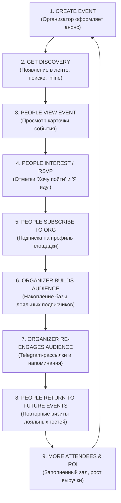
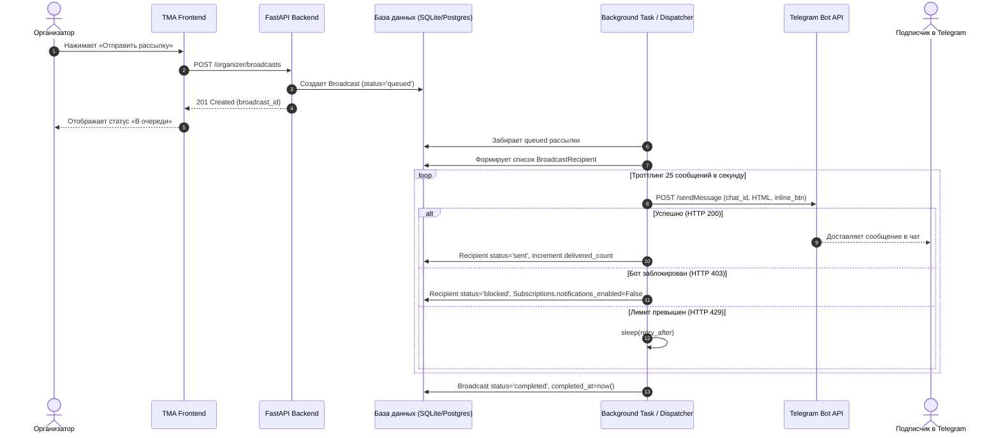

# Ivently — Стратегический и архитектурный аудит: Аудитория, Рассылки и Монетизация (D3, D4, D5)

> **Статус документа:** Утверждённый архитектурно-продуктовый аудит (Approved Strategy & Architecture Audit)  
> **Версия:** 1.0.0  
> **Базовый коммит:** `4f022ac` (D2.1.1 — Analytics Semantics + Event Lifecycle Polish)  
> **Тестовое покрытие:** 123 backend tests passed (100% green), Frontend build clean  
> **Направление:** Подготовка к устойчивой монетизации (Ivently Pro ~299 руб/мес) через доказанную ценность  

---

## Введение и руководящий принцип

Главная цель развития платформы Ivently — **не просто продать подписку за 299 руб/мес**, а создать замкнутый, измеримый цикл ценности для организатора городских событий:

> *«Ivently помогает мне собирать людей на мои события, формировать собственную базу лояльных подписчиков в Telegram, общаться с этой аудиторией без цензуры алгоритмов и точно понимать, что работает, а что нет».*

Платная подписка **Ivently Pro** должна обладать очевидной регулярной ценностью. Мы категорически отвергаем:
- Искусственное урезание базового функционала (создание событий, модерация, публикация, RSVP всегда остаются бесплатными).
- Продажу «воздуха» (косметические и бесполезные плашки, фиктивные счетчики, «бусты» без реального охвата).
- Скрытые спам-инструменты и торговлю персональными данными пользователей.

---

## ФАЗА 1. Исчерпывающий аудит существующего продукта и кодовой базы

### 1.1. Инвентаризация моделей данных (`backend/app/models/`)

| Модель | Назначение | Существующие поля и индексы | Потенциал переиспользования для D3–D5 |
| :--- | :--- | :--- | :--- |
| **`Event`** | Карточка события, статус модерации, площадка | `id` (UUID), `title`, `description`, `cover_image_url`, `start_at`, `status` (`pending`, `published`, `rejected`, `cancelled`), `organizer_user_id`, `organization_id`, `city_id`, `category_id`, `venue_name`, `address`, `price_amount`, `price_currency`. Индекс: `idx_events_discovery`. | **Готово к использованию.** Связывает событие с организацией и автором. Служит якорем для целевых рассылок («Обновление по событию»). |
| **`Organization`** | Профиль заведения, клуба или комьюнити | `id` (UUID), `owner_user_id`, `name`, `slug`, `category`, `city_id`, `address`, `avatar_url`, `status` (`active`, `disabled`), `is_verified`. Индекс: `idx_organizations_owner_status`. | **Готово к использованию.** Является центром притяжения подписчиков (Hub). Поле `is_verified` уже заложено в модель. |
| **`Subscription`** | Подписка пользователя на организацию | `id` (UUID), `user_id`, `organization_id`, `notifications_enabled` (Boolean, default `True`), `created_at`. Индекс: `idx_subscriptions_org_user`, `UniqueConstraint("user_id", "organization_id")`. | **Ключевой актив для D3 и D4.** Поле `notifications_enabled` уже существует! Не требует миграции для базового opt-in/opt-out. |
| **`EventAttendee`** | Подтверждённая регистрация («Я иду» / RSVP) | `event_id`, `user_id` (Composite PK), `created_at` (UTC). | **Готово.** Фиксирует конвертированных гостей. Позволяет рассчитывать показатель повторных посещений (Retention). |
| **`EventInterest`** | Закладка / вишлист («Хочу пойти») | `id` (UUID), `event_id`, `user_id`, `created_at` (UTC). Индексы по `event_id` и `user_id`. | **Готово.** «Тёплая» аудитория события. Идеальная база для предсобытийных напоминаний (D4). |
| **`EventView`** | Уникальные просмотры карточки мероприятия | `id` (UUID), `event_id`, `user_id`, `source` (`unknown`, `feed`, `search`, `deep_link`), `created_at`. Индексы дедупликации (2-часовое окно). | **Готово.** Знаменатель воронки конверсии. Позволяет оценивать привлекательность афиши. |
| **`User`** | Профиль пользователя Telegram | `id` (int PK), `telegram_id` (BigInt unique), `username`, `first_name`, `last_name`, `avatar_url`, `default_city_id`. | **Приватный контур.** `telegram_id` используется исключительно ботом для отправки сообщений, никогда не отдаётся на фронтенд. |
| **`EventCompany*`** | Поиск компании («Найти компанию») | P2P-механика взаимного согласия. | Организатору отдаётся только агрегированное число ищущих компанию. Детали строго изолированы. |

### 1.2. Инвентаризация сервисов и инфраструктуры уведомлений

1. **`notification_service.py`:**
   - Функция `notify_organization_subscribers(event_id)`:
     - Выбирает всех подписчиков организации со статусом `notifications_enabled == True`.
     - Формирует HTML-текст сообщения с кнопкой Telegram WebApp Deep Link (`t.me/bot/app?startapp=event_<id>`).
     - Отправляет сообщения методом `POST https://api.telegram.org/bot<token>/sendMessage`.
     - *Ограничение текущей реализации:* отправка происходит в цикле `async for` напрямую в вызывающем процессе. Отсутствует очередь сообщений (Message Queue), нет обработки лимита Telegram (30 сообщений/сек) и нет персистентного лога доставленных/ошибочных сообщений.
2. **`telegram_bot.py`:**
   - Поддерживает inline-поиск (`@bot`), глубокие ссылки (`event_<id>`, `org_<id>`), генерацию нативных кнопок Telegram WebApp (`style="primary"`, `web_app`).
   - Инфраструктура готова для маршрутизации целевых переходов из рассылок.
3. **`OrganizerWorkspace.tsx` и `OrganizerTab.tsx`:**
   - Полностью разделены потребительский хаб («Мои события») и профессиональный кабинет («Кабинет организатора»).
   - Существуют вкладки «Обзор», «Мероприятия», «Организации».
   - Имеются карточки агрегированной статистики: Просмотры, Гости, Интерес, Подписчики.
   - Готово выделенное место под четвёртую вкладку: **«Аудитория» (Audience)**.

---

## ФАЗА 2. Петля ценности организатора (Organizer Value Loop)



### Анализ измеримости каждого этапа:

| Этап петли | Существующие метрики | Недостающие метрики | Что считать скептически / отклонить |
| :--- | :--- | :--- | :--- |
| **1. Create Event** | `events_count`, статус (`pending`, `published`) | Время модерации, полнота заполнения | — |
| **2. Discovery** | Доступность в поиске/городе | Показы в ленте (Impressions) | *Отклонить:* «Потенциальный охват» (выдуманная цифра). |
| **3. View Event** | `views_count` (с дедупликацией 2 часа) | Динамика просмотров по дням, источник (`source`) | *Отклонить:* Сырые неуникальные клики без защиты от накрутки. |
| **4. Interest / RSVP** | `attendee_count`, `interest_count`, конверсия | Скорость набора отметок до даты события | *Отклонить:* Размытые «реакции» или скрытые закладки. |
| **5. Subscribe** | `followers_count` организации | **Атрибуция подписки:** с какого именно события подписался пользователь | *Отклонить:* Показ личных контактов без согласия. |
| **6. Build Audience** | Общее число подписчиков | Динамика (+N за 7/30 дней), активная аудитория (были активны <60 дней) | *Отклонить:* Виртуальные «лиды» без привязки к аккаунту. |
| **7. Re-engage** | Авто-уведомление о новом событии | **Статистика рассылок:** доставлено, прочитано, переходов по ссылке | *Отклонить:* Неконтролируемый спам всем посетителям подряд. |
| **8. Return** | Нет | **Retention rate:** доля повторных гостей среди зарегистрировавшихся | *Отклонить:* Сравнение с абстрактными бенчмарками рынка. |
| **9. More Attendees** | Суммарные гости по всем событиям | Прирост за счёт собственной базы vs органики афиши | *Отклонить:* Фиктивный «калькулятор сэкономленного рекламного бюджета». |

---

## ФАЗА 3. Дизайн спринта D3: Аудитория (Audience)

Вкладка **«Аудитория»** в `OrganizerWorkspace` переводит фокус организатора с разовых событий на **долгосрочный социальный капитал**.

### 3.1. Ключевые показатели и срезы

1. **База подписчиков заведения (`total_subscribers`):**
   - Текущий объём базы в Telegram.
   - Прирост: за последние 7 дней и за последние 30 дней.
2. **Охват вовлечённых людей (`unique_engaged_reach`):**
   - Количество уникальных людей, которые за всё время хотя бы раз нажали «Я иду», «Хочу пойти» или подписались на организацию.
3. **Эффективность событий по генерации аудитории (Event Subscriber Attribution):**
   - Таблица событий с колонкой: *«Привлекло подписчиков: +14»*.
   - Организатор видит, какой формат контента растит его постоянную базу, а какой работает вхолостую.
4. **Показатель постоянных гостей (Returning Attendees / Repeat Rate):**
   - Процент гостей на текущих событиях, которые ранее уже были на мероприятиях этой площадки (`repeat_attendees_percent`).
5. **Активность базы (Audience Health Score):**
   - Доля подписчиков, взаимодействовавших с анонсами за последние 60 дней (живая база vs уснувшие аккаунты).

### 3.2. Модель приватности и безопасность данных

> [!IMPORTANT]
> **Абсолютный запрет на экспорт персональных данных:**  
> Организатору **категорически запрещено** передавать телефонные номера, email-адреса, внутренние числовые ID базы данных и приватные `telegram_id`.

- **Отображение списков:**
  - В базовом режиме организатор видит **исключительно агрегированную аналитику и сегменты**.
  - Telegram `username` раскрывается **только** в том случае, если пользователь имеет публичный никнейм и явно дал согласие на регистрацию на закрытое мероприятие со списком гостей у входа (Guest List).
  - Сбор контактов для продажи на сторону невозможен архитектурно.

### 3.3. Разделение функционала: Free vs Pro в D3 Audience

| Возможность | Free (Бесплатный базовый) | Pro (Подписка 299 ₽/мес) |
| :--- | :--- | :--- |
| **Счётчик подписчиков** | Общее количество + прирост за 7 дней | Общее количество + прирост за 7 и 30 дней |
| **График динамики базы** | Недоступен (только число) | Интерактивный график роста за 30 / 90 дней |
| **Атрибуция подписчиков к событиям** | Топ-1 событие-драйвер | Полный список событий с указанием числа привлечённых подписчиков |
| **Аналитика повторных гостей (Repeat Rate)** | Недоступно | Расчёт % постоянных гостей по прошедшим событиям |
| **Индекс активности базы** | Недоступно | % активных подписчиков (активность за 60 дней) |
| **Экспорт сводного PDF-отчета** | Недоступно | Сводка для инвесторов / партнёров без личных данных |

---

## ФАЗА 4. Дизайн спринта D4: Telegram-рассылки организатора (Broadcasts)

### 4.1. Анализ и селекция целевых аудиторий

Мы провели строгий аудит допустимых типов адресатов с точки зрения антиспам-политики Telegram и доверия пользователей:

```
[ Посетители городских событий в Ivently ]
     │
     ├── 1. Подписчики организации ────────► [ РАЗРЕШЕНО ] Прямой opt-in, основа системы
     ├── 2. Нажали "Хочу пойти" на событие ─► [ РАЗРЕШЕНО ] Контекстно: только напоминания об ЭТОМ событии
     ├── 3. Прошлые посетители событий ────► [ ОТКЛОНЕНО ] Высокий риск жалоб на спам (нет opt-in на рассылку)
     └── 4. Просмотревшие афишу (Views) ───► [ СТРОГО ЗАПРЕЩЕНО ] Неэтичный спам без согласия
```

1. **Подписчики организации (`organization_subscribers`):**
   - **Статус: РАЗРЕШЕНО.** Пользователь лично нажал «Подписаться» на заведение/организатора.
   - **Условие:** `Subscription.notifications_enabled == True`.
   - **Сценарии:** Главный анонс месяца, открытие продаж, спецпрограмма заведения.
2. **Отметка «Хочу пойти» (`event_interest`):**
   - **Статус: РАЗРЕШЕНО (с жестким контекстным ограничением).**
   - **Условие:** Рассылка может касаться **только этого конкретного события** («Напоминаем: концерт уже завтра», «Осталось 10 билетов»). Отправка рекламы *других* событий по этой базе строго заблокирована валидатором.
3. **Прошлые посетители без подписки (`past_attendees`):**
   - **Статус: ОТКЛОНЕНО.** Человек, посетивший лекцию 4 месяца назад, не подписывался на регулярные сообщения. Несанкционированная рассылка вызовет кнопку «Report Spam» в Telegram и блокировку бота платформы.
   - **Альтернатива:** На карточке прошедшего события предлагать посетителю: *«Подпишитесь на организатора, чтобы первыми узнавать о новых событиях»*.
4. **Просмотры без действий (`event_viewers`):**
   - **Статус: КАТЕГОРИЧЕСКИ ЗАПРЕЩЕНО.**

### 4.2. Механика защиты от спама и лимиты Telegram Bot API

- **Технические лимиты Telegram:**
  - Общий лимит Bot API: не более 30 сообщений в секунду суммарно.
  - Лимит на один чат: не более 1 сообщения в секунду.
  - Ошибка `429 Too Many Requests`: требует приостановки очереди на `retry_after` секунд.
  - Ошибка `403 Forbidden: bot was blocked by the user`: пользователь заблокировал бота. Система обязана автоматически выставить `Subscription.notifications_enabled = False`, чтобы больше никогда не пытаться слать ему сообщения.
- **Пользовательские квоты частоты (Fatigue Limits):**
  - **Лимит для заведения (Free):** 1 рассылка в календарный месяц (до 50 подписчиков).
  - **Лимит для заведения (Pro):** до 4 рассылок в месяц (не чаще 1 раза в 48 часов).
  - **Глобальная защита пользователя:** один пользователь Ivently не может получить более **1 маркетинговой рассылки в 24 часа**, даже если он подписан на 10 разных заведений (защита входящих Telegram).
- **Обязательный Opt-Out:**
  - Каждое сообщение рассылки содержит inline-кнопку: `🔕 Отписаться`, вызывающую моментальное снятие флага `notifications_enabled` без перехода в сторонние браузеры.

### 4.3. Шаблонизация, предпросмотр и процесс отправки

Во избежание фишинга и мусорного спама организаторам предоставляются структурированные шаблоны:
- **Шаблон A (Анонс события):** Обложка + Название + Дата/время + Адрес + Кнопка открытия Mini App. Текст организатора ограничен 280 символами.
- **Шаблон B (Напоминание по вишлисту):** Дата до события + Призыв взять билет/подтвердить участие.
- **Шаблон C (Важное оперативное изменение):** Изменение времени, смена зала, перенос из-за погоды.

**Пошаговый UX отправщика (Wizard):**
1. Выбор сегмента (Подписчики или Вишлист конкретного события).
2. Выбор шаблона и заполнение краткого авторского текста.
3. Живой предпросмотр: интерфейс показывает карточку в точности так, как она придет в Telegram-чат.
4. Калькулятор аудитории: *«Сообщение будет отправлено: 74 подписчикам»*.
5. Модальное окно подтверждения: *«Отправить рассылку сейчас? Отменить действие будет нельзя»*.

### 4.4. Доставка и статистика

Каждая рассылка получает детальный аналитический трек:
- `recipients_count`: Всего в выборке.
- `delivered_count`: Успешно доставлено (HTTP 200).
- `blocked_count`: Пользователи, заблокировавшие бота (HTTP 403).
- `clicked_count`: Количество переходов в Mini App (через уникальный параметр deep link `?startapp=event_{id}_bc_{broadcast_id}`).

---

## ФАЗА 5. Архитектура подписки Ivently Pro (~299 руб/мес)

### 5.1. Классификация возможностей платформы

```
┌────────────────────────────────────────────────────────────────────────┐
│ FREE (Безусловный базис)                                               │
│ • Публикация событий без лимита на количество                          │
│ • Стандартная модерация администраторами платформы                    │
│ • Базовый профиль организации (до 2 организаций)                      │
│ • Доступ ко всей аудитории афиши и поиска                             │
│ • RSVP («Я иду»), «Хочу пойти» и «Найти компанию»                     │
│ • Базовая статистика: Просмотры, Гости, Интерес, Подписчики           │
│ • Авто-оповещение подписчиков при одобрении нового события            │
│ • 1 ручная рассылка в месяц (до 50 подписчиков)                        │
└────────────────────────────────────┬───────────────────────────────────┘
                                     │ Upgrade за 299 ₽ / месяц
┌────────────────────────────────────▼───────────────────────────────────┐
│ PRO (Профессиональный инструмент продвижения и CRM)                    │
│ 1. Расширенные рассылки: до 4 рассылок в месяц на всю базу             │
│ 2. Контекстные напоминания тем, кто нажал «Хочу пойти»                 │
│ 3. Аналитика аудитории: динамика 30/90 дней, Retention, атрибуция     │
│ 4. Статистика переходов из рассылок (CTR)                              │
│ 5. Бейдж верификации организации и приоритет в каталоге               │
│ 6. Управление до 5 организациями на одном аккаунте                     │
└────────────────────────────────────┬───────────────────────────────────┘
                                     │ Отклонено / Отложено
┌────────────────────────────────────▼───────────────────────────────────┐
│ REJECTED / FUTURE (Скептический аудит: продавать запрещено)            │
│ ❌ Платное создание событий -> Убивает наполнение каталога             │
│ ❌ Продажа контактов пользователей -> Нарушает закон и приватность    │
│ ❌ Безлимитный спам -> Приведёт к блокировке Telegram-бота             │
│ ❌ Платный RSVP для гостей -> Ломает пользовательскую воронку         │
│ ❌ Фиктивные значки («Топ недели») без реального трафика -> Обман      │
└────────────────────────────────────────────────────────────────────────┘
```

### 5.2. Строгая оценка Pro-функций по 8 критериям

#### 1. Расширенный пакет целевых Telegram-рассылок (4 рассылки/мес вместо 1)
1. *Какую проблему решает:* Заведение проводит 4–8 событий в месяц, но базовое авто-уведомление теряется; требуется персональный контакт перед выходными.
2. *Частота использования:* 1 раз в неделю.
3. *Измеримая ценность:* Прямая доставка в личные сообщения Telegram с конверсией в открытие >40%.
4. *Почему организатор заплатит 299 ₽:* Таргетированная реклама во ВКонтакте или Telegram Ads на 500 человек стоит от 1500 ₽. 299 ₽ — это стоимость одной чашки кофе за прямой канал ко всей своей базе.
5. *Демонстрация ценности в UI:* Счётчик доставленных сообщений и открытий афиши.
6. *Инфраструктура:* Требуется асинхронный воркер рассылок с контролем троттлинга.
7. *Риски спама:* Минимальны за счет лимита 1 раз в 48 часов и opt-in подписки.
8. *Вердикт:* **СИЛЬНАЯ ФИЧА (Ядро Pro).**

#### 2. Дожим вишлиста («Напоминание тем, кто нажал Хочу пойти»)
1. *Какую проблему решает:* Люди сохраняют событие в вишлист, но забывают о нём к выходным.
2. *Частота использования:* Перед каждым крупным событием (за 24–48 часов).
3. *Измеримая ценность:* Возврат до 20–30% «тёплых» пользователей в реальных гостей.
4. *Почему организатор заплатит 299 ₽:* Прямое спасение заполняемости зала без доплат за рекламу.
5. *Демонстрация ценности в UI:* «18 человек из вишлиста подтвердили приход после напоминания».
6. *Инфраструктура:* Переиспользует движок рассылок с фильтром по `EventInterest`.
7. *Риски спама:* Низкие, так как отправляется только 1 напоминание и только по сохраненному событию.
8. *Вердикт:* **СИЛЬНАЯ ФИЧА.**

#### 3. Глубокая аналитика аудитории (Атрибуция подписчиков + Repeat Rate)
1. *Какую проблему решает:* Организатор не понимает, какие события формируют постоянную базу, а какие привлекают разовых случайных зрителей.
2. *Частота использования:* 2–4 раза в месяц при подведении итогов.
3. *Измеримая ценность:* Оптимизация репертуара заведения под ядро постоянных клиентов.
4. *Почему организатор заплатит 299 ₽:* Дает управленческую ясность владельцу бизнеса.
5. *Демонстрация ценности в UI:* Наглядные графики и процент повторных гостей.
6. *Инфраструктура:* Оптимизированные SQL-запросы без внешних платных сервисов.
7. *Риски спама:* Нулевые (только чтение агрегированных данных).
8. *Вердикт:* **СИЛЬНАЯ ФИЧА.**

#### 4. Значок верификации заведения (`is_verified`) и статус проверенного организатора
1. *Какую проблему решает:* Доверие пользователей при покупке билетов и выборе места.
2. *Частота использования:* Постоянно отображается в карточках и профиле.
3. *Измеримая ценность:* Рост кликабельности в общей ленте событий на 10–15%.
4. *Почему организатор заплатит 299 ₽:* Статусный элемент и выделение среди конкурентов.
5. *Демонстрация ценности в UI:* Иконка щита с галочкой рядом с названием заведения.
6. *Инфраструктура:* Поле `is_verified` уже существует в модели `Organization`.
7. *Риски спама:* Отсутствуют.
8. *Вердикт:* **УМЕРЕННО СИЛЬНАЯ ФИЧА (Отличный довесок к Pro).**

---

## ФАЗА 6. Дизайн «Aha-момента» организатора

Организатор принимает решение об оплате подписки не из-за баннеров, а в момент, когда **система наглядно доказывает свою полезность на реальных цифрах**:

```
┌────────────────────────────────────────────────────────────────────────┐
│ Сценарий «Aha-момента» в интерфейсе:                                   │
│                                                                        │
│ 1. Организатор видит карточку прошедшего концерта:                     │
│    👀 312 просмотров  ──►  ❤️ 34 интерес  ──►  🎟 18 гостей (RSVP)     │
│                                                                        │
│ 2. Система показывает инсайт в разделе «Аудитория»:                    │
│    👥 «Этот концерт привлек +14 новых подписчиков в ваш профиль.       │
│        Всего ваша база в Ivently: 92 человека».                        │
│                                                                        │
│ 3. Организатор планирует следующий концерт через 2 недели:             │
│    🔔 «Вы можете отправить личное приглашение 92 постоянным             │
│        подписчикам прямо в Telegram одним нажатием».                   │
│                                                                        │
│ 4. Организатор отправляет рассылку:                                    │
│    📊 Уже через 20 минут: 41 открытие анонса и 8 первых регистраций.   │
│                                                                        │
│ AHA-MOMENT: «Ivently собрал мне зал без затрат на таргетолога!»       │
└────────────────────────────────────────────────────────────────────────┘
```

Дашборд кабинета организатора должен строиться вокруг этой прозрачной нарративной цепочки, **исключая любые псевдо-метрики и вымышленные расчеты экономии**.

---

## ФАЗА 7. Монетизация без Dark Patterns (Этичный UX)

Платформа Ivently уважает организаторов и пользователей, поэтому конверсионный UX проектируется по правилам честного продукта:

1. **Честное позиционирование тарифов:**
   - Четкая таблица сравнения Free и Pro. Никаких скрытых звездочек и неожиданных списаний.
   - Фиксированная цена: **299 ₽ в месяц** (или эквивалент в Telegram Stars ~150 Stars).
2. **Прозрачность периода и отмены:**
   - Дата следующего расчетного периода видна прямо в настройках кабинета.
   - Отмена подписки в 1 клик прямо внутри Telegram Mini App. Никаких обязательных опросов из 10 вопросов и пряток кнопки «Отменить».
3. **Безопасный Downgrade (Что происходит при окончании подписки):**
   - Ни одно событие **НЕ** удаляется и **НЕ** снимается с публикации.
   - Профиль организации остается активным со всеми накопленными подписчиками.
   - История аналитики **НЕ** стирается (исторические данные сохраняются).
   - Лимиты мягко возвращаются к бесплатному уровню: 1 рассылка в месяц, базовая сводка за 7 дней.
4. **Категорический запрет на манипулятивные техники:**
   - ❌ Никаких таймеров обратного отсчета: *«Скидка 80% сгорит через 04:59»*.
   - ❌ Никаких ложных счетчиков спроса: *«Ещё 7 организаторов смотрят этот тариф»*.
   - ❌ Никаких навязчивых модальных окон при каждом входе в приложение.

---

## ФАЗА 8. Рекомендуемый поэтапный план реализации (Roadmap)

Для исключения переделок и регрессий работы разбиваются на строгую цепочку спринтов:

```
[ Спринт D3.0 ] Бэкенд аудитории (SQL-агрегаты, когорты, атрибуция)
       │
[ Спринт D3.1 ] Фронтенд аудитории (Вкладка «Аудитория» в Workspace)
       │
[ Спринт D4.0 ] Движок рассылок (Модели Broadcast, воркер с троттлингом 30 msg/s)
       │
[ Спринт D4.1 ] Интерфейс рассылок (Визард отправки, живой предпросмотр в TMA)
       │
[ Спринт D4.2 ] Доставка и аналитика кликов (Логирование статусов, трекинг deep link)
       │
[ Спринт D5.0 ] Модель прав и квот (OrganizerEntitlement, Free vs Pro лимиты)
       │
[ Спринт D5.1 ] Интерфейс Pro-кабинета (Витрина ценности, бейджи верификации)
       │
[ Спринт D5.2 ] Интеграция платежей (Telegram Stars / ЮKassa, вебхуки, биллинг)
```

---

## ФАЗА 9. Архитектурная спецификация данных и API

### 9.1. Предлагаемые сущности базы данных

#### 1. `Broadcast` (Кампания рассылки)
- `id`: `String(36)` (UUID PK).
- `organization_id`: `String(36)` (FK `organizations.id` ON DELETE CASCADE).
- `created_by_user_id`: `Integer` (FK `users.id` ON DELETE CASCADE).
- `event_id`: `String(36)` (FK `events.id` ON DELETE SET NULL, опционально привязанное событие).
- `target_type`: `String(30)` (`organization_subscribers`, `event_interest`).
- `template_key`: `String(50)` (`event_announcement`, `event_reminder`, `custom_update`).
- `custom_text`: `Text` (краткий комментарий автора до 300 символов).
- `status`: `String(20)` (`draft`, `scheduled`, `processing`, `completed`, `failed`).
- `total_recipients`: `Integer` (плановое количество адресатов).
- `delivered_count`: `Integer` (успешно отправлено).
- `failed_count`: `Integer` (ошибки отправки).
- `blocked_count`: `Integer` (число пользователей, заблокировавших бота, 403).
- `created_at`: `DateTime(timezone=True)`.
- `completed_at`: `DateTime(timezone=True)`.
- *Индексы:* `("organization_id", "created_at")`, `("status", "created_at")`.

#### 2. `BroadcastRecipient` (Лог доставки конкретному адресату)
- `id`: `String(36)` (UUID PK).
- `broadcast_id`: `String(36)` (FK `broadcasts.id` ON DELETE CASCADE).
- `user_id`: `Integer` (FK `users.id` ON DELETE CASCADE).
- `telegram_id`: `BigInteger` (для отправки через Bot API).
- `status`: `String(20)` (`pending`, `sent`, `failed`, `blocked`).
- `error_message`: `String(255)` (nullable, текст ошибки при сбое).
- `sent_at`: `DateTime(timezone=True)` (nullable).
- `clicked_at`: `DateTime(timezone=True)` (nullable, факт перехода по ссылке из рассылки).
- *Индексы:* `("broadcast_id", "status")`, `("user_id", "sent_at")`.

#### 3. `OrganizerEntitlement` (Статус подписки и квоты организатора)
- `id`: `String(36)` (UUID PK).
- `user_id`: `Integer` (FK `users.id` ON DELETE CASCADE, Unique).
- `tier`: `String(20)` (`free`, `pro`, default `free`).
- `valid_until`: `DateTime(timezone=True)` (nullable для free).
- `provider`: `String(30)` (`telegram_stars`, `yookassa`, `admin_grant`).
- `broadcasts_used_this_month`: `Integer` (default 0).
- `quota_reset_at`: `DateTime(timezone=True)` (дата сброса ежемесячного лимита).
- *Индексы:* `("user_id", "tier")`.

### 9.2. Спецификация API Endpoints

```
# Аудитория (D3)
GET    /api/v1/organizer/audience                     — Сводные метрики аудитории (подписчики, динамика, охват)
GET    /api/v1/organizer/audience/events-attribution  — Атрибуция прироста подписчиков по конкретным событиям
GET    /api/v1/organizer/audience/retention           — Анализ возвращаемости гостей (% повторных визитов)

# Рассылки (D4)
GET    /api/v1/organizer/broadcasts                   — История рассылок организации со статусами и CTR
POST   /api/v1/organizer/broadcasts/preview           — Расчет доступной аудитории и генерация превью сообщения
POST   /api/v1/organizer/broadcasts                   — Создание и постановка рассылки в очередь отправки
GET    /api/v1/organizer/broadcasts/{id}              — Прогресс выполнения и детальная статистика доставки

# Подписка Pro и биллинг (D5)
GET    /api/v1/organizer/subscription                 — Текущий тарифный план, доступные квоты и дата продления
POST   /api/v1/organizer/subscription/checkout        — Создание инвойса (Telegram Stars invoice link или платежная сессия)
POST   /api/v1/organizer/subscription/cancel          — Отмена автопродления подписки
POST   /api/v1/webhooks/telegram-stars                — Обработка платежного вебхука Telegram Stars
```

### 9.3. Асинхронный воркер рассылок и соблюдение лимитов Telegram



---

## ФАЗА 10. Итоговое продуктовое решение (10 ключевых решений)

1. **ТЕКУЩАЯ ЦЕННОСТЬ ПРОДУКТА:**  
   Ivently обладает надежным функционалом: создание событий, публикация, категоризация, города, модерация, RSVP («Я иду»), вишлист («Хочу пойти»), профили заведений, подписки на заведения, поиск «Найти компанию» и базовая аналитика просмотров с дедупликацией. Платформа уже решает задачу анонсирования городских событий.

2. **НЕДОСТАЮЩАЯ ЦЕННОСТЬ (Разрыв):**  
   Организатор не видит, как его события конвертируются в постоянную аудиторию. Подписчики у заведения копятся, но у организатора нет инструмента связаться с ними в нужный момент, кроме автоматического оповещения при публикации. Нет атрибуции подписчиков и понимания повторных визитов.

3. **ПЛАН D3 (АУДИТОРИЯ):**  
   Создать выделенный раздел «Аудитория» в Organizer Workspace. Показать рост базы за 7/30 дней, атрибуцию прироста подписчиков к конкретным событиям и процент повторных гостей (Retention). Обеспечить 100% защиту приватности: никаких утечек номеров, email или приватных Telegram ID.

4. **ПЛАН D4 (РАССЫЛКИ):**  
   Реализовать контролируемый инструмент Telegram-рассылок по строгому opt-in: подписчикам заведения и вишлисту конкретного события. Отклонить рассылки по прошлым гостям без подписки и по просмотревшим афишу во избежание спама. Внедрить жесткие ограничения частоты (1 раз в 48 часов, глобальный лимит 1 рассылка/24ч на пользователя), авто-отписку при 403 Forbidden и фоновый воркер с троттлингом 25 сообщений/сек.

5. **ПЛАН D5 (IVENTLY PRO ~299 ₽/мес):**  
   Сформировать подписку Pro вокруг осязаемой пользы: 4 рассылки в месяц вместо 1, персональные напоминания по вишлисту за 24–48 часов до начала события, глубокая аналитика динамики и повторных гостей, верифицированный статус заведения и до 5 организаций на аккаунте.

6. **МАТРИЦА FREE VS PRO:**  
   - **Free:** Создание событий без лимитов, модерация, присутствие в афише и поиске, RSVP/Вишлист, базовая статистика (просмотры, гости, интерес, подписчики), авто-уведомление при публикации, 1 ручная рассылка в месяц (до 50 адресатов).
   - **Pro (299 ₽/мес):** 4 рассылки в месяц на всю базу, напоминания по «Хочу пойти», 30/90-дневные графики и Retention, статистика переходов из рассылок (CTR), значок верификации и приоритет в выдаче, до 5 заведений на аккаунте.

7. **ТОЧНОЕ ЦЕННОСТНОЕ ПРЕДЛОЖЕНИЕ (Value Proposition):**  
   *«Ivently Pro за 299 ₽ в месяц окупается с первого же проданного билета или одного дополнительного гостя в зале: вы получаете собственный канал связи со своей городской аудиторией прямо в Telegram без цензуры алгоритмов социальных сетей».*

8. **РИСКИ МОНЕТИЗАЦИИ И ИХ МИТИГАЦИЯ:**  
   - *Риск блокировки Telegram-бота из-за спама:* Митигируется жестким лимитом частоты, обязательностью opt-in и кнопкой мгновенной отписки в каждом сообщении.
   - *Риск слабого спроса:* Митигируется тем, что организатор сначала видит накопление своей базы и «Aha-момент» на бесплатном тарифе, и переходит на Pro, когда размер базы превышает 50 человек.
   - *Риск падения качества афиши при пейволле:* Базовое создание событий остается бесплатным навсегда, контентный приток не страдает.

9. **ПОРЯДОК РЕАЛИЗАЦИИ:**  
   Строго последовательно: `D3.0 -> D3.1 -> D4.0 -> D4.1 -> D4.2 -> D5.0 -> D5.1 -> D5.2`. Никакой код платежей не пишется до готовности механик аудитории и рассылок.

10. **ЧТО ДОЛЖНО БЫТЬ ПОСТРОЕНО В ПЕРВУЮ ОЧЕРЕДЬ:**  
    **Спринт D3.0 (Audience Foundation Backend)**: разработка SQL-запросов и эндпоинтов для сводной аналитики аудитории, подсчета прироста подписчиков за 7/30 дней, атрибуции подписчиков к событиям и расчета коэффициента повторных гостей на основе уже существующих данных таблиц `subscriptions`, `events`, `event_attendees` и `event_interests`.
