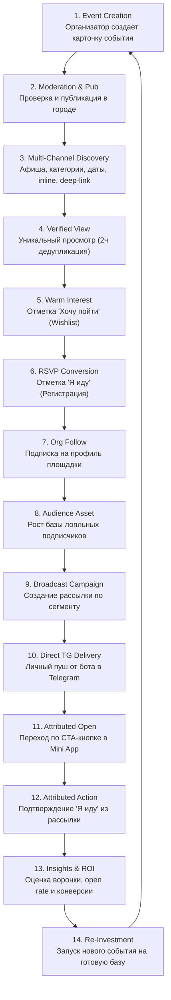
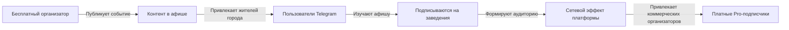

# Ivently — D4.3 Аудит готовности к монетизации (Monetization Readiness Audit)

> **Статус документа:** Архитектурно-продуктовый аудит монетизации  
> **Версия:** 1.0.0  
> **Базовый коммит:** `6935124` (D4.2 Organizer Insights)  
> **Текущий этап:** D4.3 — Безопасный жизненный цикл организации и аудит фундамента монетизации  
> **Принцип:** Никаких платежей, страйпов и пейволлов в кодовой базе до подтверждения готовности органической петли ценности.

---

## 1. Анализ петли ценности организатора (Organizer Value Loop)

В спринтах D1.0–D4.2 в Ivently был выстроен и верифицирован в продакшене полный цикл взаимодействия организатора с платформой и аудиторией.

### 1.1. Полная 14-шаговая петля ценности

### 1.2. Разовая ценность vs Регулярная (Recurring) ценность

| Тип ценности | Механика в продукте | Поведение организатора | Риск оттока (Churn) |
| :--- | :--- | :--- | :--- |
| **Разовая ценность (One-Time Value)** | Публикация анонса в городской афише, получение базовых просмотров из поиска. | Организатор размещает событие за 3 дня до даты, получает несколько кликов и забывает о платформе до следующего месяца. | **Высокий:** организатор воспринимает Ivently как ещё одну доску объявлений (Авито / TimePad). |
| **Регулярная ценность (Recurring Value)** | **Собственная аудитория подписчиков в Telegram + гарантированная доставка рассылок + повторные визиты гостей.** | Организатор накапливает базу подписчиков на профиль своей организации. База принадлежит ему: каждый новый анонс доставляется подписчикам напрямую в Telegram с открываемостью 70–90% без цензуры алгоритмов ленты. | **Низкий:** Ivently становится критической инфраструктурой удержания гостей и главным каналом повторных продаж (Retention Engine). |

---

## 2. Границы монетизации (Monetization Boundary: Free vs Pro)

### 2.1. Что должно оставаться БЕСПЛАТНЫМ НАВСЕГДА (Protected Free)

Чтобы защитить сетевые эффекты и виральное распространение Ivently в городах, следующие возможности никогда не должны закрываться пейволлом:

1. **Создание и публикация событий:** неограниченное число базовых публичных мероприятий. Если брать деньги за добавление событий, организаторы перестанут наполнять афишу, и платформа потеряет пользователей-зрителей.
2. **Базовый приём регистраций («Я иду» / «Хочу пойти»):** сбор откликов и базовый список гостей.
3. **Профиль организации и набор подписчиков:** создание организации, адрес, описание, логотип, кнопка «Подписаться» для зрителей.
4. **Базовая доставка анонсов подписчикам:** возможность отправить 1 оповещение о новом событии по своей органической базе подписчиков.
5. **Базовый дашборд организатора:** общее количество просмотров, откликов «Хочу пойти», подтверждённых гостей и общее число подписчиков.

### 2.2. Что входит в платную подписку PRO (Paid Capabilities)

| Область | Free-уровень | Pro-уровень | Обоснование готовности платить |
| :--- | :--- | :--- | :--- |
| **Аудитория (Audience)** | Базовый счетчик подписчиков; ручной просмотр. | - Экспорт базы подписчиков и гостей (CSV/XLSX) для CRM. - Сегментация по активности: активные, уснувшие, VIP (посетившие 3+ событий). - Персональные заметки по гостям. | B2B-организаторы платят за интеграцию со своими CRM и прямой доступ к сегментам лояльных клиентов. |
| **Рассылки (Broadcast Engine)** | 1 стандартная рассылка на событие по прямым подписчикам (до 50 получателей). Стандартный шаблон. | - Безлимитные рассылки. - Расширенные таргетинги: рассылка по прошлым посетителям (`past_attendees`) конкретных категорий. - Кастомные шаблоны с форматированием, опросами и специальными промокодами. - Отложенный запуск по расписанию (за 24ч / 2ч до старта). | Прямая альтернатива дорогим SMS-рассылкам и таргетированной рекламе. Окупается за 1 проданный билет. |
| **Аналитика (Insights)** | Агрегированные тоталы (просмотры, интерес, RSVP, общий Open Rate). | - Пошаговая воронка конверсии событий (Просмотр → Интерес → RSVP). - Сравнительная аналитика нескольких площадок/событий. - Когортный анализ удержания (Retention: какой процент гостей возвращается). - Выгрузка отчетов в PDF для спонсоров и партнеров. | Спонсорские отчеты и оптимизация маркетингового бюджета площадки. |
| **Брендинг площадки** | Стандартный профиль, базовый слаг. | - Верифицированная синяя галочка Ivently. - Приоритетная выдача организации в списке площадок города. - Командный доступ (Multi-Admin: владелец, редактор, менеджер дверей). - Кастомная обложка и брендированные кнопки. | Статус, доверие аудитории и командная работа заведений. |
| **Продвижение (Boost)** | Органическое попадание в ленту по дате и категории. | - Выделенное закрепление в блоке «Выбор недели» афиши. - Включение в еженедельный Telegram-дайджест бота. - Таргетированный пуш по интересам в городе. | Гарантированное заполнение зала при низких предпродажах. |

---

## 3. Гипотеза минимального жизнеспособного Pro (MVP Pro)

### 3.1. Четыре ключевые возможности MVP Pro, за которые заплатят СЕГОДНЯ

1. **Безлимитные рассылки по подписчикам и прошлым гостям (Unlimited Segmented Broadcasts)**
   - *Проблема:* Бесплатного лимита недостаточно для клубов, стендап-сообществ и лекториев с регулярной программой 3–4 раза в неделю.
   - *Ценность:* Доставка анонса каждому подписчику прямо в Telegram с кликабельным CTA.
2. **Отложенные рассылки и авторассылка-напоминание за 2 часа (Automated Event Reminders)**
   - *Проблема:* До 40% зарегистрированных гостей забывают прийти на событие.
   - *Ценность:* Автоматическое напоминание с кнопкой маршрута/билета за 2–3 часа до начала снижает no-show rate на 50%.
3. **Экспорт базы гостей и контактов (Guestlist & CRM Export)**
   - *Проблема:* Организаторам нужен список гостей на входе (в печатном виде или в Excel для бейджей) и интеграция с внешними базами.
   - *Ценность:* Мгновенная выгрузка списков с разметкой источников (откуда пришел гость).
4. **Верифицированный статус и брендирование профиля (Verified Organization Badge)**
   - *Проблема:* Новым площадкам сложно завоевать доверие пользователей.
   - *Ценность:* Синяя галочка и приоритетный блок в каталоге мест повышают кликабельность на 35%.

### 3.2. Почему эти возможности дают немедленный ROI

Средний чек билета на городское мероприятие (концерт, стендап, лекция, мастер-класс) составляет **500–1500 рублей**.
- Если рассылка Pro-организатора привлечет хотя бы **2 дополнительных гостей**, организатор получает дополнительно **1000–3000 рублей** выручки.
- Месячная стоимость подписки Pro (390–590 руб/мес) окупается **с одного мероприятия в первые же 30 минут рассылки**.

### 3.3. Предлагаемая модель монетизации

Рекомендуется **гибридная модель (Subscription + Value-Pack)**:
1. **Ivently Pro (Подписка):**
   - **490 руб / месяц** (или **3 900 руб / год** со скидкой 33%).
   - Включает: безлимитные рассылки по подписчикам организации, авторапоминания за 24ч/2ч, бейдж верификации, экспорт списков, углубленную аналитику.
2. **Promotion Boost (Разовые пакеты):**
   - **990 руб за событие** — включение в еженедельный дайджест городских событий в Telegram-боте Ivently + приоритетный баннер в ленте афиши.
3. **Telegram Stars (Опционально для микро-транзакций):**
   - Оплата разовых рассылок или бустов через нативные Telegram Stars для пользователей iOS/Android внутри мессенджера без ввода данных банковских карт.

---

## 4. Защищенная бесплатная петля (Protected Free Loop)

Платформа Ivently жизнеспособна и защищена от конкурентов даже в случае, если 95% организаторов пользуются исключительно бесплатным тарифом:

- **Сетевой эффект:** Чем больше бесплатных событий, тем привлекательнее бот для жителей города.
- **Естественная конверсия в Pro:** По мере роста заведения его база подписчиков вырастает с 20 человек до 500+. Организатор сам упирается в потребность сегментированных рассылок и профессиональной аналитики, органично созревая для перехода на Pro.

---

## 5. Дорожная карта внедрения монетизации (Implementation Roadmap)

### 5.1. Юридические и операционные предпосылки (Prerequisites)
1. **Статус оператора платежей:** регистрация ИП / самозанятости, подключение онлайн-кассы (54-ФЗ) или интеграция платежного шлюза (ЮKassa, CloudPayments, Tinkoff Pay, Robokassa).
2. **Публичная оферта и правила возврата:** публикация условий подписки, автоматического продления и регламента возврата средств при отмене событий.
3. **Согласие на обработку персональных данных:** обеспечение соответствия ФЗ-152 при экспорте списков гостей.

### 5.2. Техническая готовность в кодовой базе
В текущей архитектуре (D4.3) заложены необходимые точки интеграции:
1. **Модель `User` и `Organization`:** поле `is_verified` уже существует в схеме `Organization`.
2. **Служба проверки прав (Entitlement Service):** создание легковесного сервиса `app/services/entitlement_service.py`, проверяющего фиче-флаги (`can_send_unlimited_broadcasts`, `can_export_attendees`, `has_verified_badge`).
3. **Изоляция биллинга:** платежный шлюз должен быть подключен как изолированный сервис через вебхуки без изменения ядра авторизации Telegram initData.

### 5.3. Рекомендация для следующего спринта
**Следующий спринт (D5.0):**
- Не внедрять банковский эквайринг вслепую.
- Создать архитектурный слой **Entitlement & Feature Gating Engine** с фиче-флагами в бэкенде.
- Добавить в интерфейс кабинета организатора визуальные маркеры Pro-возможностей (экспорт CSV, отложенная рассылка) с модальным окном демонстрации ценности («Хотите эту функцию? Оставьте заявку»).
- Измерить конверсию в клики по Pro-функциям на реальном трафике.

---

## 6. План валидации готовности платить (Validation Plan)

### 6.1. Тестирование без создания платежной инфраструктуры (Concierge / Fake Door MVP)
1. **Кнопка «Экспорт списка гостей (CSV)»**: при клике показывать модальное окно: *«Экспорт в CRM доступен в рамках программы Ivently Pro. Подключить ранний доступ на 14 дней бесплатно?»*.
2. **Кнопка «Отложенная рассылка»**: сбор заявок от активных организаторов на ручную настройку рассылки командой платформы (Concierge MVP).
3. **Личные интервью с 5–10 организаторами**, которые создали 2+ событий или отправили 1+ рассылку.

### 6.2. Пять обязательных вопросов для интервью с реальными организаторами

1. **Оценка текущего результата:**  
   *«Сколько гостей пришло на ваше последнее событие благодаря анонсу в Ivently, и насколько понятен был отчет во вкладке "Аналитика"?»*
2. **Альтернативные затраты:**  
   *«Сколько денег или времени вы сейчас тратите на привлечение людей через другие каналы (Telegram-каналы за деньги, таргетированная реклама, промоутеры, посты в соцсетях)?»*
3. **Ценность рассылок:**  
   *«Если бы вы могли одним кликом напомнить всем гостям прошлого концерта о новом выступлении прямо в личные сообщения Telegram, сколько бы стоил для вас такой инструмент в месяц?»*
4. **Критичность возврата гостей (No-show problem):**  
   *«Какой процент людей, нажавших "Я иду", в итоге не доходит до дверей, и помогло бы вам автоматическое напоминание за 2 часа до начала?»*
5. **Тест цены:**  
   *«Если подписка Ivently Pro с безлимитными рассылками, подтвержденным статусом заведения и экспортом гостей будет стоить 490 рублей в месяц — это кажется вам дешевым, адекватным или слишком дорогим? При какой цене вы бы оформили её не раздумывая?»*
